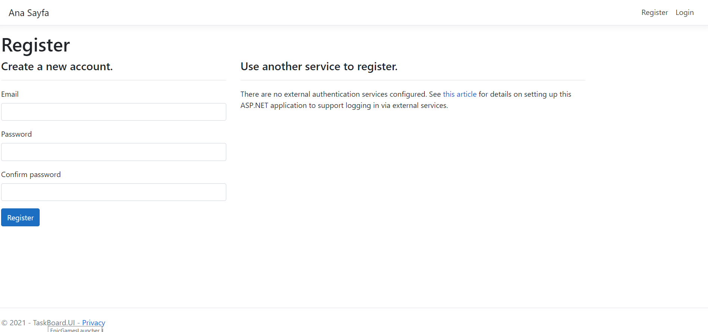
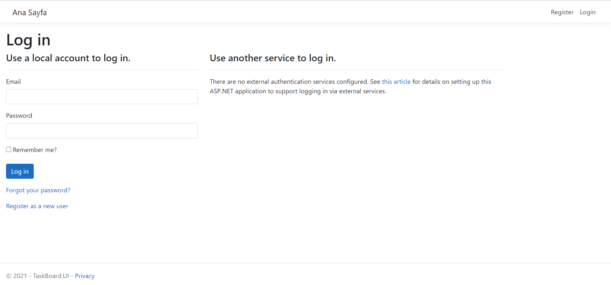
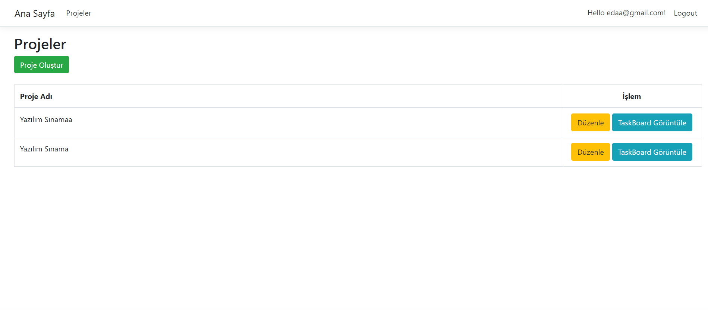
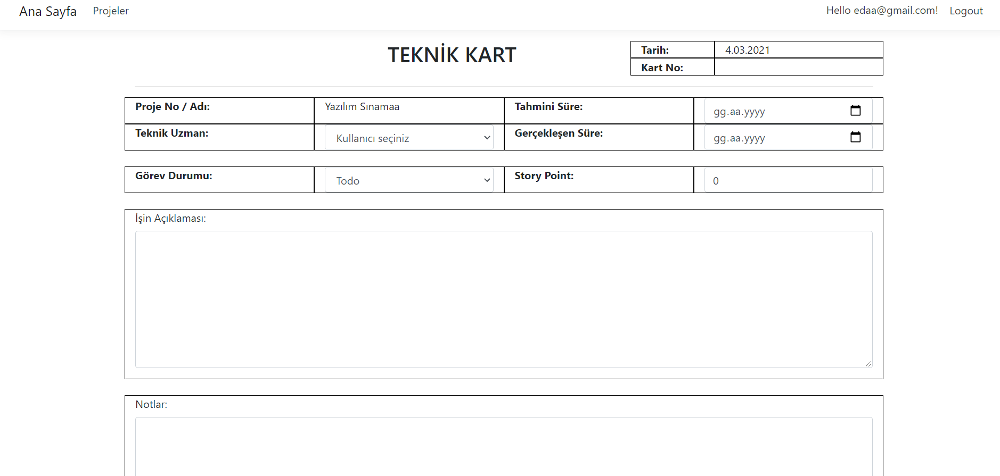
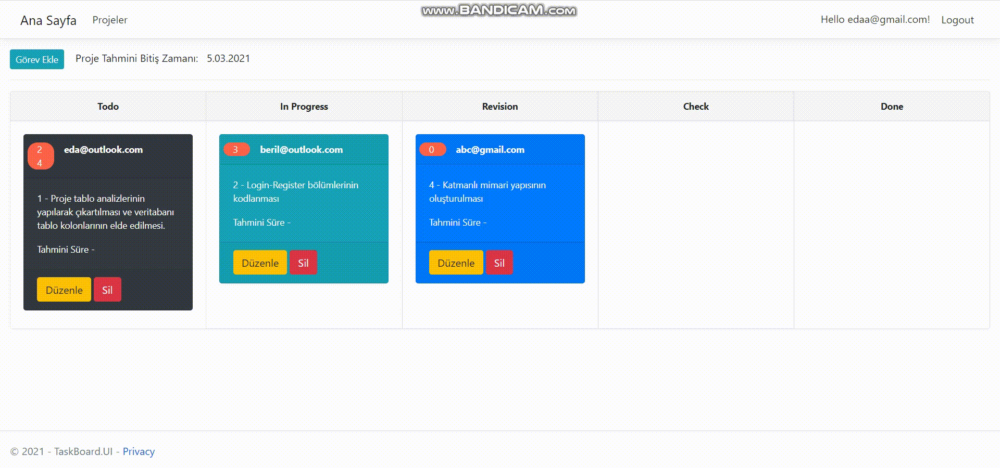

# TaskBoard

# Ekran Görüntüleri
## Register Ekranı
<b>Açıklama</b>:<br>
<i>Kullanıcı üye olup e-mailini onaylamadan programa giriş yapamaz. Programa girmek isteyen kullanıcı üye olmak için bu ekranla karşılaşır.</i><br>



## Login Ekranı
<b>Açıklama</b>:<br>
<i>Kullanıcı üye olup e-mailini onayladıktan sonra programa bu ekrandan giriş yapabilir.</i><br>



## Proje Ekleme Ekranı
<b>Açıklama</b>:<br>
<i>Projelerimizi ekleyip, düzenleyip ve ```Task Board```da görüntüleyebildiğimiz bir ekran.</i><br>



## Teknik Kart Ekranı
<b>Açıklama</b>:<br>
<i>Task Board'da görüntülediğimiz kartları ekleme, düzenleme ve story pointlerini belirlediğimiz bölümü.</i><br>



## TaskBoard Ekranı
<b>Açıklama</b>:<br>
<i>Task Board'da görüntülediğimiz kartları drag-drop ile diğer bölümlere aktarma ekranı.</i><br>


